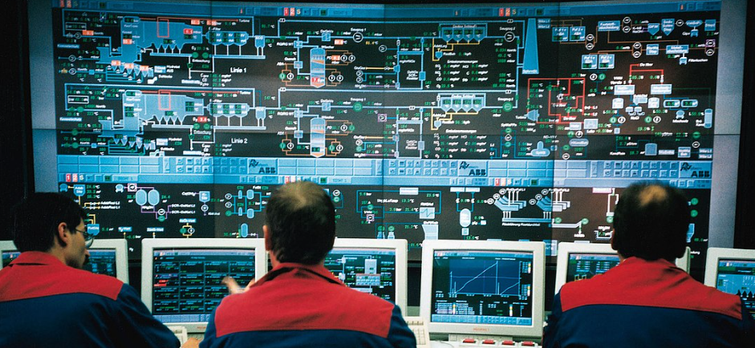

<h1>What is ISA 95</h1>
- It's a standard describing the interface between content manufacturing operations, and functions with enterprise functions. 
- It consists of a 5 layer process 

|layer|Mild description|Sample tools used|
|--|--|--|
|0|consists of physical plant items| Machines, and devices|
|1|anything that controls devices in lvl 0 | PLCs or logic controllers|
|2|systems that communicate with items in   lvl 1| PI, or historians |
|3|systems that monitor data inside lvl 2   to define actifities| MES | 
|4| Business related systems|ERPs|

Table of contents 

- [Level 0](#level-0)
  - [Level 0 - Two types of manufacturing](#level-0---two-types-of-manufacturing)
    - [Process manufacturing](#process-manufacturing)
      - [Continous process](#continous-process)
      - [Batch process](#batch-process)
    - [Discrete manufacturing](#discrete-manufacturing)
  - [Level 0 - 11 terms](#level-0---11-terms)
  - [Level 0 - Typical process variable measurement](#level-0---typical-process-variable-measurement)
  - [Level 0 - input/output devices](#level-0---inputoutput-devices)
    - [Input devices](#input-devices)
    - [Output devices](#output-devices)
  - [Level 0 - Sensors vs actuators](#level-0---sensors-vs-actuators)
    - [Sensors](#sensors)
      - [Types of sensors](#types-of-sensors)
    - [Actuators](#actuators)
      - [Types of actuators](#types-of-actuators)
- [Level 1](#level-1)
  - [Level 1 - Control systems](#level-1---control-systems)
    - [Control loops](#control-loops)
      - [Open control loops](#open-control-loops)
      - [Closed control loops](#closed-control-loops)
        - [Feedback control](#feedback-control)
        - [Forward feedback control](#forward-feedback-control)
  - [Level 1 - industrial control systems overview](#level-1---industrial-control-systems-overview)
  - [Level 1 - PLCs](#level-1---plcs)
  - [Level 1 - 10 factors for selecting a PLC](#level-1---10-factors-for-selecting-a-plc)
  - [Level 1 - 6 factors for selecting a DCS](#level-1---6-factors-for-selecting-a-dcs)
  - [Level 1- Communication  lvl 1/lvl 0 protocols](#level-1--communication--lvl-1lvl-0-protocols)
- [Level 2](#level-2)
  - [Level 2 - Data acquisition, monitoring and visualization](#level-2---data-acquisition-monitoring-and-visualization)
    - [Data aquisition](#data-aquisition)
    - [Advanced process control](#advanced-process-control)
    - [Visualiztion](#visualiztion)
    - [Data monitoring](#data-monitoring)
    - [Data storage and archival](#data-storage-and-archival)
    - [SCADA](#scada)
    - [RTU](#rtu)
  - [Level 2 - Components found in  SCADA](#level-2---components-found-in--scada)
  - [Level 2 - features of SCADA](#level-2---features-of-scada)
    - [6 activities](#6-activities)
    - [8 features](#8-features)
  - [Level 2 - redundancy in SCADA](#level-2---redundancy-in-scada)
    - [Cold redundancy](#cold-redundancy)
    - [Hot redundancy](#hot-redundancy)
    - [Dual network path](#dual-network-path)
  - [Level 2 - 6 types of recordings](#level-2---6-types-of-recordings)
- [Level 3](#level-3)
  - [Level 3 - MES what is it](#level-3---mes-what-is-it)
  - [Level 3 MOM ( Manufacturing Operation management) fonctionalities](#level-3-mom--manufacturing-operation-management-fonctionalities)

# Level 0 

## Level 0 - Two types of manufacturing
   1.  Process 
   2.  Discrete
   
### Process manufacturing
- products are made from forulas and recipies
- end products cannot be broken down at the end of prodution cycle
- example:
  - Food 
  - milk 
- can be further divided into **continuous process** or **Batch process**
#### Continous process 
- runs without any break, creating the same product at a specific rate
- examples
  - pasta production 
  - milk production 
  - juice production 
  - ice cream produciton 
#### Batch process
- runs with different steps
-  examples
   -  fast food production 
   -  cheese 
### Discrete manufacturing 
- Things made from assembled goods
- examples
  - cars
  - computers
## Level 0 - 11 terms 
||Term| Definition|
|--|--|--|
|1|Process variable|The measured value of ongoing part of a process being monitored or controlled   ex: the speed, the volume|
|2|instruments|Devices that are being used for  measuring controlling and recording|
|3|transducer |A device converting physical qty to electric quantity|
|4|calibration|comparison of measurement values delivered a by a device under test with accuracy 
|5|controller|a device in control loop which regulates error rsignals to the zero   or   a device  that regulates behavior  of other devices  or process variables|
|6|transmission |A method of sending data between various instruments of a plant in a standardized form
|7|Transmitter|A device which converts measurement value into a standard signal
|8|Instrumentation| A comnplete set of instruments used to control a process
|9|Set point| The desired value required by the operator of an essential variable of a system
|10|Accuracy|The conformity of an accepted value to an accepted standard.   the limit of error that can be made by an instrument
|11|Span|The algebraic difference between the upper range and lower range values
## Level 0 - Typical process variable measurement 
It usually goes like this:
   
 

**The sensor** sends signals  
**The amplifier or Conditioner** amplifies signals sent by the sensor such that it can be caught by display 
**The display** displays signals by the sensor through amplifier

## Level 0 - input/output devices
### Input devices 
They provide input signals to controllers
Examples are: 
- valves
- switches
- flow transmitter
- pressure transmitter
  
### Output devices
They receive output signals from controllers
Examples are:
- Relay
- LED lamps
- valves

## Level 0 - Sensors vs actuators

### Sensors 
They are devices used to gauge the quantity in any form and provide it to a readable display
Note: Gauge means to measure. 
#### Types of sensors
- electromagnetic
- mechanical
- chemical 
- acoustic 

### Actuators
They are devices used for controlling a mechanism or system
#### Types of actuators
- hydraulic
- electric
- thermal or magnetic
- mechanical
- pneumatic ( ie this be dealing with air pressure stuff)

# Level 1

## Level 1 - Control systems
- It is a system containing devices that can manage/control level 0 devices
- It is used to control **process variables**
- Control over level 0 components is achieved in **control loops**

### Control loops
- They are controllers that control process variables
- There are two types of control loops. 
  - Open control loops
  - Closed control loops
#### Open control loops
- They operate regardless the values of the process variables. 
- Examples : 
  - toaster
  - hand dryer
  - microwave
#### Closed control loops
- They operarte to set process variables to a set point
  - ex: a thermostat
- There are two types
  - Feedback control
  - Forward feedback control
##### Feedback control
 - It is when the process variable is compared to the set point, and the controls adjust accordingly to keep the setpoint
 - Example : cruise control
##### Forward feedback control
- It's a type of feedback control which takes into account disturbance
  - Example, if you have cruise control , and you are going  on a slope. The slope would be a distrubance. Controls will then be modified accordingly to keep setpoint. 
## Level 1 - industrial control systems overview 
- Control systems provide architecture of plant controllers
- Interface systems required for plant process ( or components)
- This is kinda what a control system looks like
- There are 3 types of control system architectures
  1. local control system
  2. centralized control system ( mostly used in small plants)
  3. distributed control system  aka DCS ( mostly used in big plants)
## Level 1 - PLCs
- 3 main functions 
  - Monitor inputs
  - Make decisions
  - Control outputs to automate machines
- Inputs provide logic using CPU and output is sent to actuators
- The CPU is the brain of the PLC
- Types of PLC output
  - Relay 
  - Transistor
  - Triac
- PLC Classification according to the size
  - micro
  - mini 
  - nano
- Components
  - Power supply 
  - CPU
  - inputs
  - outputs
## Level 1 - 10 factors for selecting a PLC 
1. System requirements
2. application requirements
3. input output capacity
4. electrical requirements
5. speed of operation 
6. communication requirements
7. software
8. operator interface
9. physical environment
10. types of inout/output 
## Level 1 - 6 factors for selecting a DCS
1. PLC section parameters
2. redundancy offering
3. DCS standard compliance
4. Training availability 
5. tech support
6. rapid exchange

## Level 1- Communication  lvl 1/lvl 0 protocols
There are many, but the following seems important
- HART - seems to be used in modern environments 
- Modbus - implements slave  master architecture, also can be implempented further into  protocols like TCP/IP , or ASCII
- DNP3
- IEC Technical - standards for tele control

# Level 2 
## Level 2 - Data acquisition, monitoring and visualization
### Data aquisition 
Thats when data is taken from control system 
### Advanced process control
It's a control technique implemented to **address particular performance** or **economic improvement**

### Visualiztion
Its about giving real time status  of production process
### Data monitoring
alloes wofr providing insights to help take proper actions
### Data storage and archival 
Its about moving data that is no longer actively used
### SCADA
acronum system control and data acquisistion 
it does two things
- system control
- data acquisition
### RTU 
it's a computer that interfaces SCADA

## Level 2 - Components found in  SCADA
1. Computers & laptops
2. RTUs & PLCs
3. HMI

## Level 2 - features of SCADA
### 6 activities
1. Data acquisition 
2. Data communication 
3. Data presentation 
4. Data Monitoring
5. Data Diagnostics
6. alrams, trends and events
### 8 features
1. Report generation 
2. Graphical representation 
3. Automatic control 
4. Remote control 
5. Alarms and notification 
6. Trending 
7. online monitoring 
8. IoT integration 

## Level 2 - redundancy in SCADA
### Cold redundancy 
- when back up device is not automatically swapped. 
- non critical processes
### Hot redundancy 
- when back up device is automatically activated
- for critical devices 
### Dual network path 
this is a method of implementing redundancies. Meaning you the backup components on another network. 

## Level 2 - 6 types of recordings 
1. Analog readings  - ex :   temperatures, weights, 
1. Digital readings - ex : valves, switches
2. Product info  - ex: product_id, batch_id
1. qualitiy info - ex:process and product limits, custom limits
1. alarm info -ex : out of limits signlas, return  to normal signals
1. aggregate data - ex: moving average

# Level 3
## Level 3 - MES what is it
- its basically a set of systems within one platform that adds value to the production process

## Level 3 MOM ( Manufacturing Operation management) fonctionalities
- Production Management
- Quality Management
- Inventory Management
- Maintenance Management