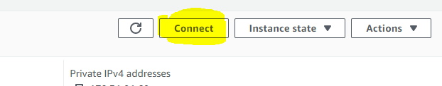

# Two types of users
- when you have an AWS account, you usually have two types of users. 
 ## Root account
  - This is a super admin user. It should not be used often unless you want to do some very super admin things.
  - There should really be one of these users
 ## IAM (ie Identity Access Management) account
  -  These accounts would usually require you use the special login link. If you don't have the link, then you'd probably enter the account ID along with the username and password.
  -  There can be more than one. This means that your AWS account can have more than one user
  -  Every IAM user has an **Access key**. It usually is useful when yuou want to log in to AWS services via code. 
     -  It is importantn to make sure that your access key is secure. Dont leave it out in the open in a git repository. 

# ARN ( ie Amazon Resource Name)
 - It's a unique identifier for any AWS resource. Whether its an EC2 instance or a S3 bucket, or an IAM user.. 
 - The ARN usually has a format as follows : 
  
   ```
    arn:partition:service:region:account-id:resource-id
    arn:partition:service:region:account-id:resource-type/resource-id
    arn:partition:service:region:account-id:resource-type:resource-id
   ``` 
   - The **partiotion** refers to the group of region where the resource is located

# Cloud Watch
  - AWS has a service called cloud watch. It is pretty much an alert system. You can use it to create alerts for billing. If for example, your server is consuming lots of RAM or CPU, then you can create an alert for that. 

# AWS Services
## EC2  
### AMI (Amazon Machine Images) Feature
 - This feature allows you to create images of an instance. 
 - Basically, if you already configured an instance, you can create an image from it, and it'll create an image that you can launch new instances from. 
### Autoscaling
 - Its about adding resources to maitain application availability. 
   - This  means that you could add a second EC2 instance to spread the availability of an application (*__Horizontal scaling__*), or you could swap the EC2 instance for a more powerful one ( *__vertical scaling__*)
### Security groups
 - Its like a firewall for your EC2 instance. 
 - Basically, you can add rules inside a security group. Rules will indicate if certain ports are open to certain components
 - You can add two EC2 instances inside the same group. However they won't be able to communitcate within each other, unless you add a rule for them to do so. 
  
### Connection ( i.e remote conection)
- you can use putty 
- you should click on the connect button, and youll see instruction with putty
  
- There are also other options on how to connect to the instance. 


## EBS ( Elastic Bag Storage)

### Snapshot 
- Its simply a backup of the hard drive. unlike AMIs, they only keep a snapshot of the memory. AMIs are backups of the EC2 instance configuration. 

### Volume 
- It's the representation of data used by an EC2 instance
- It can be analogous to a USB drive

## EFS (Elastic File storage)
- It's a solution implemening NAS ( Network access storage). It is basically used for sharing files between different volumes. 
  - it is useful because instances cannot share volumes. The EFS will take care of files shared by different EC2 instances. 

## S3 
### Bucket
  - S3 Buckets  are storage buckets like a  dropbox drive or onedrive. 
  - It's analogous to dropbox
  - Its a storage where you don't need to set up a server to store files.
  - It's useful when you have an application that allows users to upload files as they are very secure and they are hard to be breached. 
  - you can create a more public bucket and then have an application store files inside the public bucket as well. 

